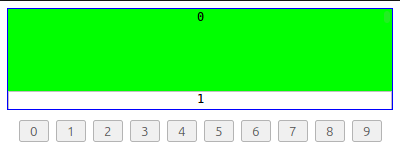

# ScrollToItem

[![Build Status][travis-image]][travis-url]
[![Dependency Status][depstat-image]][depstat-url]
[![DevDependency Status][depstat-dev-image]][depstat-dev-url]

> Scrolls list on buttons hover ([Demo](https://jsfiddle.net/VovanR/269cxg3c/))

## Usage

```javascript
var scrollToItem = new ScrollToItem({
    $scroll: $('.js-list__scroll'),
    itemClassName: '.js-list__item',
});
```


```javascript
scrollToItem.scrollToItem('0');
scrollToItem.scrollToItem('1');
scrollToItem.scrollToItem('2');
scrollToItem.scrollToItem('4');
scrollToItem.scrollToItem('1');
scrollToItem.scrollToItem('0');
scrollToItem.scrollToItem('7');
scrollToItem.scrollToItem('8');
scrollToItem.scrollToItem('0');
```

## Development

### Initialize
```sh
npm i
```

### Test
*In console*
```sh
npm run test
```

*In browser*
```sh
open ./text/index-test.html
```

### Lint
```sh
npm run lint
```

## License
MIT © [Vladimir Rodkin](https://github.com/VovanR)

[travis-url]: https://travis-ci.org/VovanR/scroll-to-item
[travis-image]: http://img.shields.io/travis/VovanR/scroll-to-item.svg

[depstat-url]: https://david-dm.org/VovanR/scroll-to-item
[depstat-image]: https://david-dm.org/VovanR/scroll-to-item.svg

[depstat-dev-url]: https://david-dm.org/VovanR/scroll-to-item
[depstat-dev-image]: https://david-dm.org/VovanR/scroll-to-item/dev-status.svg
